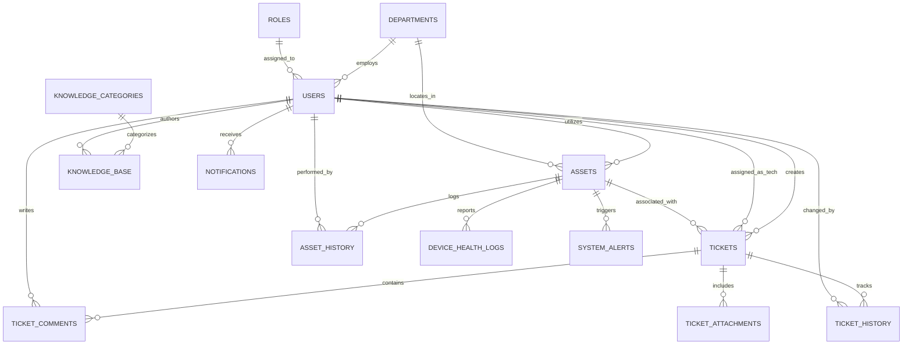

# Database Schema & Data Dictionary

## 1. Overview
The database is built on **PostgreSQL** with 14 normalized relational tables, strict foreign keys, and indexes on all search and filter columns.

## 2. Table Schemas

### `roles`
* `id` SERIAL PRIMARY KEY
* `name` VARCHAR(50) UNIQUE (EMPLOYEE, TECHNICIAN, ADMIN)
* `description` TEXT

### `departments`
* `id` UUID PRIMARY KEY DEFAULT `uuid_generate_v4()`
* `name` VARCHAR(100) UNIQUE
* `code` VARCHAR(20) UNIQUE
* `location` VARCHAR(100)
* `created_at` TIMESTAMP

### `users`
* `id` UUID PRIMARY KEY DEFAULT `uuid_generate_v4()`
* `email` VARCHAR(150) UNIQUE (Indexed)
* `password_hash` VARCHAR(255)
* `full_name` VARCHAR(100)
* `phone` VARCHAR(30)
* `job_title` VARCHAR(100)
* `role_id` INT REFERENCES `roles(id)` (Indexed)
* `department_id` UUID REFERENCES `departments(id)` (Indexed)
* `is_active` BOOLEAN DEFAULT TRUE
* `created_at`, `updated_at` TIMESTAMP

### `assets`
* `id` UUID PRIMARY KEY DEFAULT `uuid_generate_v4()`
* `asset_code` VARCHAR(50) UNIQUE (Indexed)
* `name` VARCHAR(150)
* `category` VARCHAR(50) (Indexed)
* `brand`, `model`, `serial_number` VARCHAR(100)
* `purchase_date`, `warranty_expires` DATE
* `status` VARCHAR(50) DEFAULT 'Available' (Indexed)
* `assigned_user_id` UUID REFERENCES `users(id)` (Indexed)
* `department_id` UUID REFERENCES `departments(id)`
* `location`, `ip_address`, `mac_address` VARCHAR
* `specs` JSONB
* `notes` TEXT
* `created_at`, `updated_at` TIMESTAMP

### `asset_history`
* `id` UUID PRIMARY KEY
* `asset_id` UUID REFERENCES `assets(id)` ON DELETE CASCADE
* `action` VARCHAR(50)
* `performed_by_user_id` UUID REFERENCES `users(id)`
* `target_user_id` UUID REFERENCES `users(id)`
* `notes` TEXT
* `created_at` TIMESTAMP

### `tickets`
* `id` UUID PRIMARY KEY DEFAULT `uuid_generate_v4()`
* `ticket_code` VARCHAR(50) UNIQUE (Indexed)
* `title` VARCHAR(255)
* `description` TEXT
* `category` VARCHAR(50) (Indexed)
* `priority` VARCHAR(20) (Indexed)
* `status` VARCHAR(30) DEFAULT 'Open' (Indexed)
* `created_by_user_id` UUID REFERENCES `users(id)` (Indexed)
* `assigned_tech_id` UUID REFERENCES `users(id)` (Indexed)
* `asset_id` UUID REFERENCES `assets(id)` (Indexed)
* `department_id` UUID REFERENCES `departments(id)`
* `resolution_notes`, `root_cause` TEXT
* `satisfaction_rating` INT (1 to 5)
* `feedback_comment` TEXT
* `resolved_at`, `closed_at` TIMESTAMP
* `created_at`, `updated_at` TIMESTAMP

### `ticket_comments`
* `id` UUID PRIMARY KEY
* `ticket_id` UUID REFERENCES `tickets(id)` ON DELETE CASCADE
* `user_id` UUID REFERENCES `users(id)`
* `comment` TEXT
* `is_internal_note` BOOLEAN DEFAULT FALSE
* `created_at`, `updated_at` TIMESTAMP

### `ticket_history`
* `id` UUID PRIMARY KEY
* `ticket_id` UUID REFERENCES `tickets(id)` ON DELETE CASCADE
* `changed_by_user_id` UUID REFERENCES `users(id)`
* `field_changed`, `old_value`, `new_value` TEXT
* `comment` TEXT
* `created_at` TIMESTAMP

### `device_health_logs`
* `id` UUID PRIMARY KEY
* `asset_id` UUID REFERENCES `assets(id)` ON DELETE CASCADE (Indexed)
* `hostname` VARCHAR(150) (Indexed)
* `os_info` VARCHAR(150)
* `cpu_usage`, `ram_usage`, `disk_usage` NUMERIC(5, 2)
* `ip_address`, `mac_address`, `network_status` VARCHAR
* `uptime_seconds` BIGINT
* `created_at` TIMESTAMP (Indexed)

### `system_alerts`
* `id` UUID PRIMARY KEY
* `asset_id` UUID REFERENCES `assets(id)` ON DELETE CASCADE (Indexed)
* `alert_type`, `severity`, `message` VARCHAR / TEXT
* `is_resolved` BOOLEAN DEFAULT FALSE (Indexed)
* `resolved_by_user_id` UUID REFERENCES `users(id)`
* `resolved_at`, `created_at` TIMESTAMP
